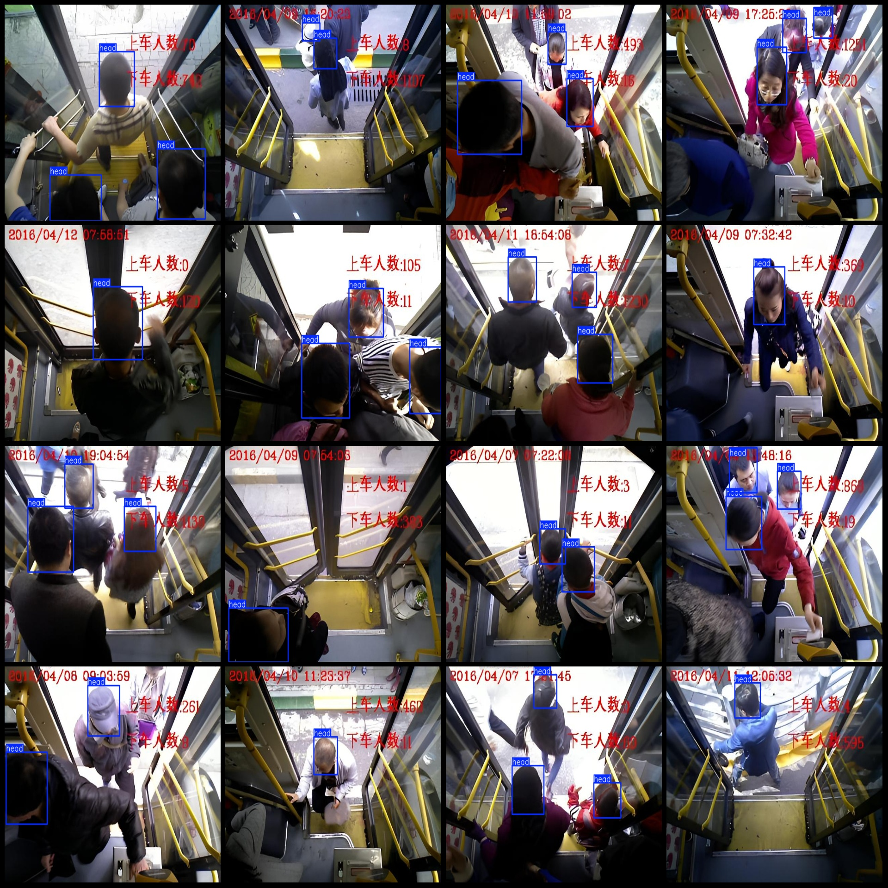
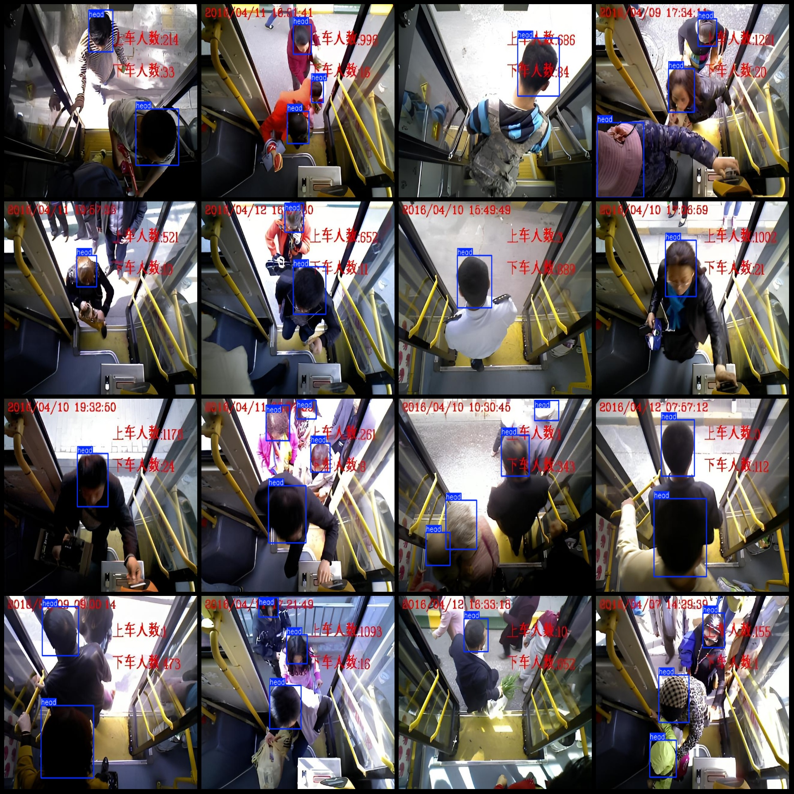

# Bus Scene Head Detection Dataset (VOC+YOLO)

The dataset is in Pascal VOC format plus YOLO format, without the split path in a .txt file, only including jpg images and corresponding VOC format xml files and YOLO format txt files.

Number of images (jpg file counts): 2295
Number of annotations (xml file counts): 2295
Number of annotations (txt file counts): 2295
Number of annotation categories: 1
Annotation category name: "head"
Number of boxes per category: 4907
Total number of boxes: 4907
Number of images occupied by each category: 2295
Image resolution: 640x480
Annotation tool used: labelImg
Annotation rules: draw boxes for each category
Important note: The dataset does not have splits for training, validation, or testing. You need to divide it yourself.
Special statement: This dataset does not guarantee the accuracy of the trained models or weight files.
Image preview:
Annotation example:

## Image

Here is a pay link on Stripe ( https://buy.stripe.com/3cs8yP7sY87d0vu9AB ). Please contact me lonlonago@foxmail.com after funding $89, and I will send you a complete data files , thank you!

